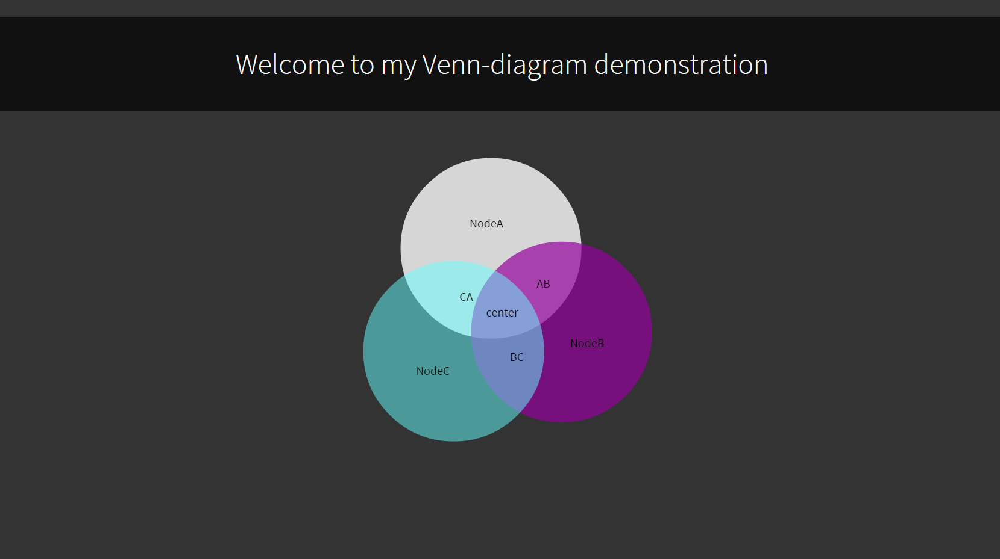

#Venn Diagrams

This is a small library thingie I wrote for Eirik (mail me your domain some time)

As can be read from the code, the original plan was to implement something a little bit different.

However I did not fully comprehend the code and therefore made this simple UI.

--------------------------------------------------------------
| known issues: | description                                |
|---------------|--------------------------------------------|
| range         | only {2,3} due to oval problem             |
--------------------------------------------------------------